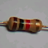
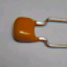
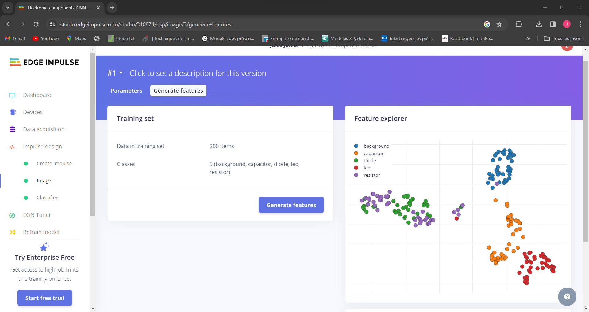
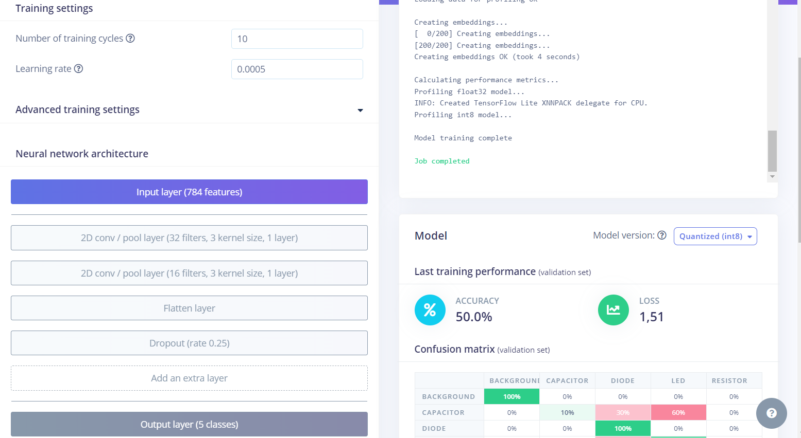
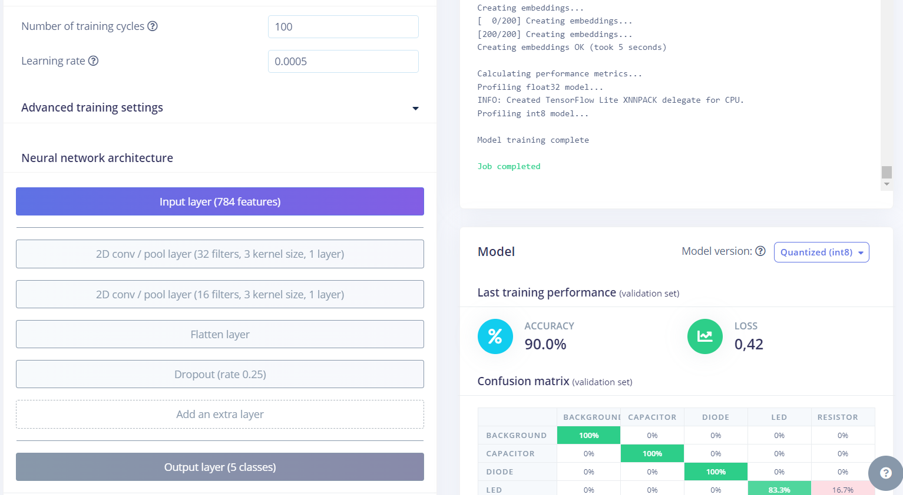

# Project_Training-a-CNN-in-Edge-Impulse
## DEscription
Dans ce projet nous utilison un ensemble de données pour former un modèle CNN sur Edge Impulse; qui permettra de détecter la nature des composants. L'objectif ici était d'explorer l'entraînement d'un réseau neuronal convolutif (CNN) à l'aide d'Edge Impulse plutôt qu'un simple réseau neuronal dense.
      
 
## 1e étape: Upload Dataset
## 2e étape: Create Impulse
## 3e étape: Extract Features
* 
## 4e étape: Entrainement du modèle

* 
* 
* 
