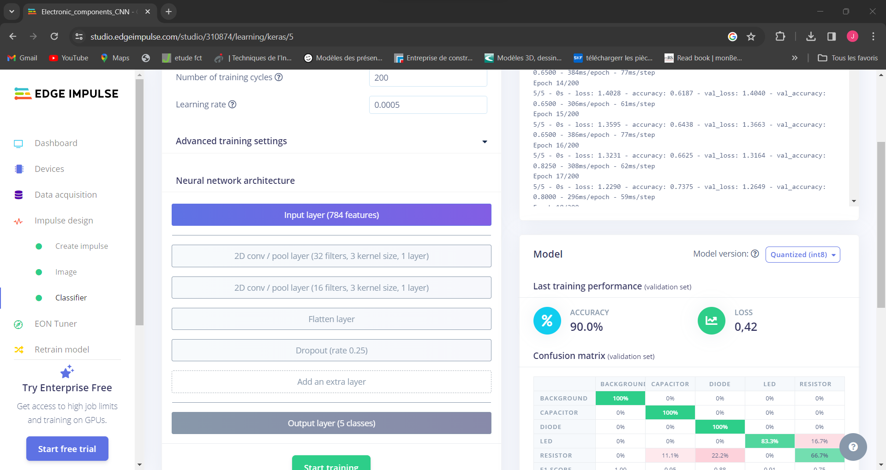

# Project_Training-a-CNN-in-Edge-Impulse
## DEscription
Dans ce projet nous utilison un ensemble de données pour former un modèle CNN sur Edge Impulse; qui permettra de détecter la nature des composants. L'objectif ici était d'explorer l'entraînement d'un réseau neuronal convolutif (CNN) à l'aide d'Edge Impulse plutôt qu'un simple réseau neuronal dense.
      
 
## 1e étape: Upload Dataset
## 2e étape: Create Impulse
## 3e étape: Extract Features
* 
## 4e étape: Entrainement du modèle

* 
* 
* 
*  la comparaison des performances entre notre modèle et l'exemple de réseau neuronal dense doit être interprétée avec prudence. Les résultats de précision sont influencés par la taille limitée de notre ensemble de données (50 échantillons par classe) et la possible répartition aléatoire des échantillons entre les ensembles de formation et de test. Ainsi la sensibilité à la variation, où le déplacement d'un seul échantillon peut entraîner une variation significative de la précision de validation, souligne la nécessité d'un ensemble de données plus important.
